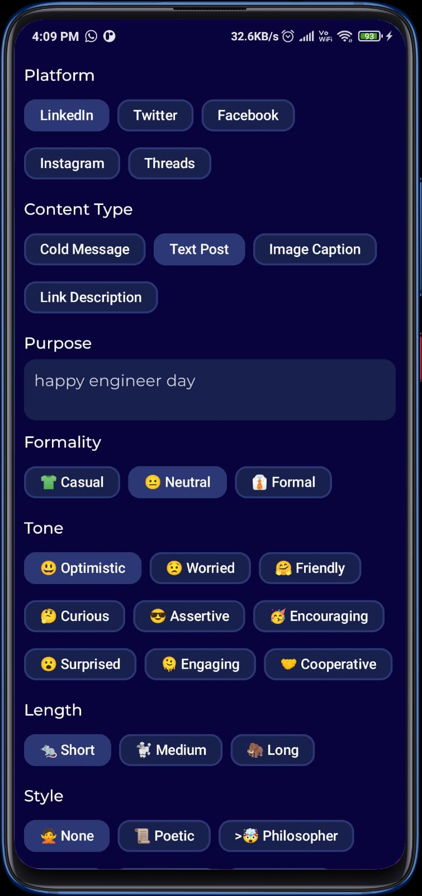
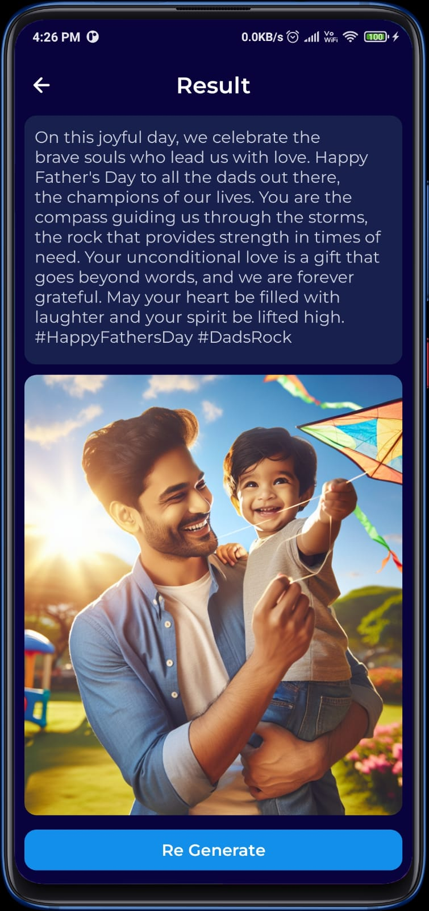

# BitPost: Your AI-Powered Social Media Content Generator 🚀📱

BitPost is an innovative Android app that leverages the capabilities of generative AI to enhance your social media content creation experience. Whether you're seeking help in crafting captivating posts, generating engaging captions, or sparking creativity for your next social media campaign, BitPost has you covered. Elevate your content game with BitPost's AI assistance and unlock a new level of efficiency and creativity!

## Table of Contents

- [Screenshots](#screenshots)
- [Installation](#installation)
- [License](#license)
- [Contribute](#how-to-contribute)

## Screenshots

|  |  |
| -------------------------- | ----------------------------- |

## Installation

### Manual Installation
1. Clone this repository to your local machine using the following command:

```bash
git clone https://github.com/YourUsername/bitpost.git
```

2. Open the project in Android Studio.

3. Build the project and install it on your Android device.

### APK Installation

1. Download the latest APK file from the "Releases" section of this GitHub repository.

2. Enable "Unknown Sources" in your Android device settings to allow the installation of apps from external sources.

3. Locate the downloaded APK file and install it on your Android device.

### API Key Configuration

1. Add your API key to the project by following these steps:

2. Open the local.properties file in the root directory of your project.

3. Add the following line with your API key in local.properties: 
```
API_KEY=your_api_key
```

## License
This project is licensed under the [GPL-3.0](./LICENSE).

## How to Contribute
Excited to contribute to BitPost? Please read our [Contribution Guidelines](./CONTRIBUTING.md) to get started. Your ideas and expertise are welcome!